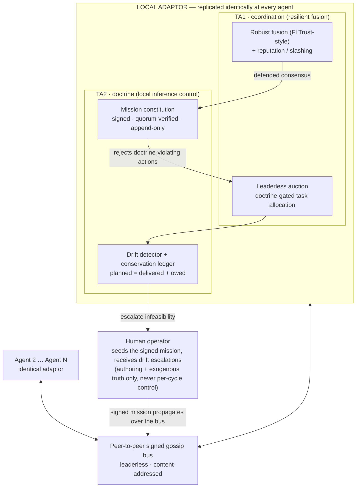
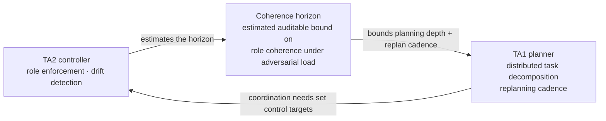
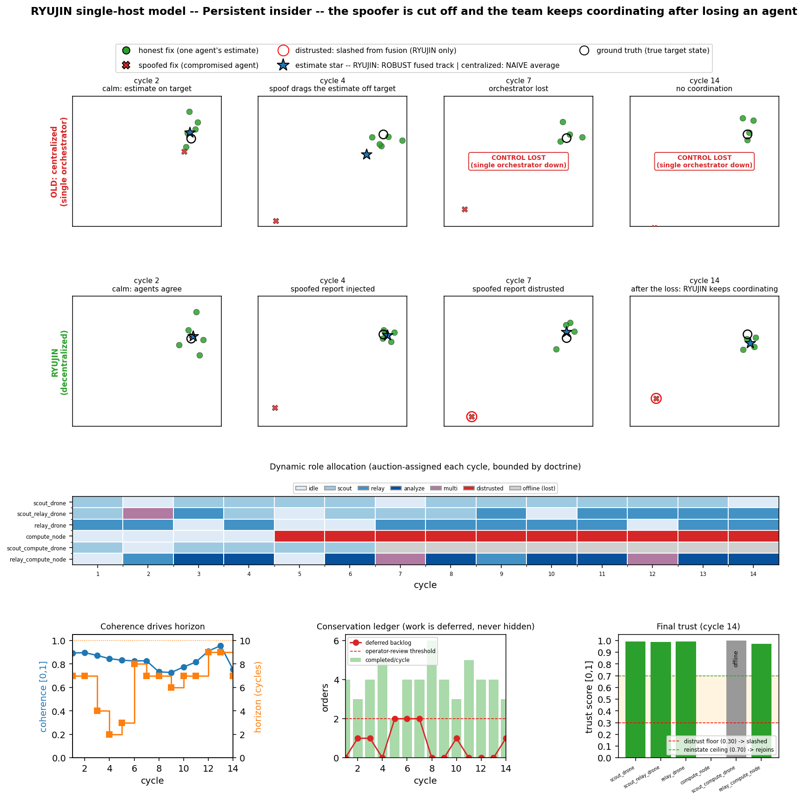
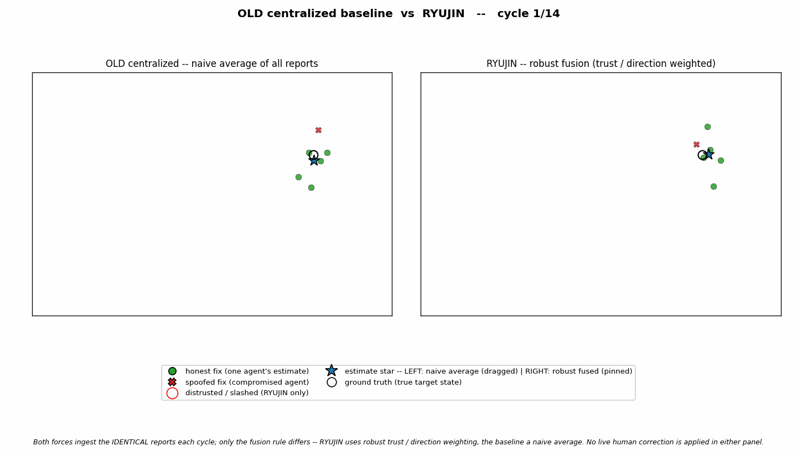

# RYUJIN

**A Doctrine-Bound, Self-Organizing, Adversary-Resilient Architecture for
Heterogeneous Multi-Agent Autonomy**

A public simulation artifact for a DARPA **DICE** (Decentralized Artificial
Intelligence through Controlled Emergence) **TA1 + TA2** abstract.

---

## What this is

RYUJIN is a per-agent **local adaptor** — replicated identically at every node,
with no central orchestrator — that delivers *controlled emergence*: a collective
of heterogeneous AI agents that coordinates and stays mission-aligned even when
some of its own members are compromised, spoofed, or lost.

It couples two layers DICE names explicitly:

- **TA1 — coordination & resilient fusion.** A leaderless, doctrine-gated auction
  allocates skill-typed tasks; robust FLTrust-style fusion plus momentum-weighted
  reputation/slashing filters poisoned or adversarial reports so a Byzantine
  insider is isolated rather than allowed to drag the collective estimate.
- **TA2 — local inference control (doctrine).** An inviolable, cryptographically
  signed **mission constitution** bounds every legal action; a drift detector and
  conservation ledger surface misalignment instead of letting it compound
  silently.

The two layers are joined by a single measurable quantity — the **coherence
horizon** — an estimated, auditable bound that the TA1 planner uses to bound
distributed planning depth and replanning cadence. This explicit, bidirectional,
*measurable* coupling is RYUJIN's distinguishing claim and the Phase 1
formalization target.

> The name is a light hook: **Ryūjin** is the dragon king of the sea in Japanese
> folklore, said to have stripped a disloyal jellyfish of its bones — the
> traditional origin story for why jellyfish have none today. The metaphor:
> a leaderless, doctrine-bound force holds its coherence under pressure; an
> adversary with no spine to begin with cannot. The architecture itself is
> hardware-agnostic and named in plain operational English throughout.

---

## Architecture at a glance



### The TA1 ↔ TA2 coupling



The diagrams below summarize the architecture exercised by the simulation. The
submitted abstract and proposal working files are intentionally not part of this
public repository.

---

## The simulation

[`sim/ryujin_sim.py`](sim/ryujin_sim.py) is a single-file, dependency-light
(stdlib-only except for optional `matplotlib`) didactic model of the architecture.
It pits RYUJIN against a centralized baseline under a persistent insider spoof and
the mid-mission loss of an agent, and demonstrates robust fusion, the leaderless
auction, recoverable reputation (hysteresis), the conservation ledger, and graceful
degradation.

```bash
# Scripted run (verbose by default), Monte-Carlo sweep, and live animation
python sim/ryujin_sim.py
python sim/ryujin_sim.py --sweep --trials=500
python sim/ryujin_sim.py --viz

# Trust posture: earn-your-standing start + side-by-side tradeoff sweep
python sim/ryujin_sim.py --zero-trust
python sim/ryujin_sim.py --trust-tradeoff

# Append --heal to any run to make the adversary repent and recover trust
python sim/ryujin_sim.py --viz --heal

# Figure / asset export (PDF- and Markdown-safe)
python sim/ryujin_sim.py --filmstrip docs/sim_images/ryujin_persistent_insider_filmstrip.png
python sim/ryujin_sim.py --compare   docs/sim_images/ryujin_persistent_insider_compare_signals.png
python sim/ryujin_sim.py --save-gif-compare docs/sim_images/ryujin_persistent_insider_baseline_vs_ryujin.gif
```

### Persistent insider — filmstrip



The top row is the legacy centralized approach (naive average): the spoof drags
its estimate off the target, and when the lone orchestrator is lost there is no
estimate at all. The second row is RYUJIN: the spoofer is identified and slashed
(red ring), and the team keeps coordinating after a real loss. The third row shows
roles being **dynamically reallocated by the auction each cycle, bounded by
doctrine**; the bottom row shows coherence/horizon, the conservation ledger, and
final trust. This static figure is the best single asset for papers, abstracts,
and quick review.

### Persistent insider — baseline vs. RYUJIN animation



Both forces ingest the *identical* reports each cycle; only the fusion **rule**
differs.

### Additional generated assets

- [`ryujin_persistent_insider_compare_signals.png`](docs/sim_images/ryujin_persistent_insider_compare_signals.png)
  — technical signal view for the persistent-insider run: trust weights,
  success-signal EMAs, throughput, coherence, and anchor error.
- [`ryujin_persistent_insider_four_panel_animation.gif`](docs/sim_images/ryujin_persistent_insider_four_panel_animation.gif)
  — four-panel animation of the persistent-insider run.
- [`ryujin_recoverable_trust_filmstrip.png`](docs/sim_images/ryujin_recoverable_trust_filmstrip.png)
  — static filmstrip for the recoverable-trust scenario where the attacker stops
  spoofing and earns trust back.
- [`ryujin_recoverable_trust_baseline_vs_ryujin.gif`](docs/sim_images/ryujin_recoverable_trust_baseline_vs_ryujin.gif)
  — side-by-side animation of the recoverable-trust scenario.
- [`ryujin_recoverable_trust_compare_signals.png`](docs/sim_images/ryujin_recoverable_trust_compare_signals.png)
  — technical signal view for the recoverable-trust run.
- [`ryujin_recoverable_trust_four_panel_animation.gif`](docs/sim_images/ryujin_recoverable_trust_four_panel_animation.gif)
  — four-panel animation of the recoverable-trust run.

---

## Repository layout

| Path | Contents |
|---|---|
| [`sim/ryujin_sim.py`](sim/ryujin_sim.py) | Didactic single-file simulation of the architecture |
| [`docs/sim_images/`](docs/sim_images/) | Generated figures and animations referenced by this README |
| [`requirements.txt`](requirements.txt) | Python dependencies (`matplotlib` + `pillow` for visualization/export) |
| [`LICENSE`](LICENSE) | Apache-2.0 license |

---

## Status & licensing

This repository contains the public simulation artifact referenced in our
submitted DARPA DICE abstract. It is licensed under **Apache-2.0**. Any
data-rights designation (e.g., Government Purpose Rights) for IP delivered
under an eventual award would be negotiated separately and does not apply to
this independently released simulation. Open-sourcing the mechanism is
deliberate: security rests on signed doctrine and keys (Kerckhoffs's
principle), not on secret algorithms.
