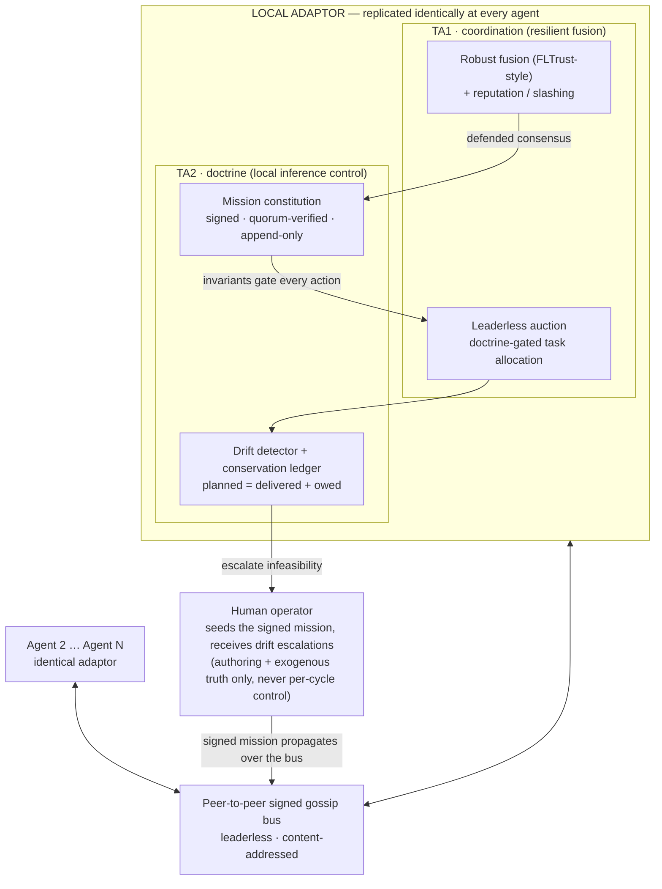
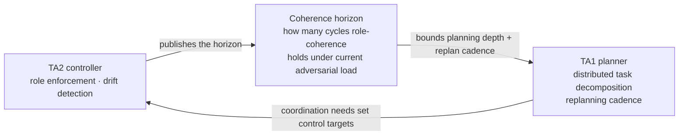

# RYUJIN

**A Doctrine-Bound, Self-Organizing, Adversary-Resilient Architecture for
Heterogeneous Multi-Agent Autonomy**

A working repository for a DARPA **DICE** (Decentralized Artificial Intelligence
through Controlled Emergence) **TA1 + TA2** proposal.

---

## What this is

RYUJIN is a per-agent **local adaptor** — replicated identically at every node,
with no central orchestrator — that delivers *controlled emergence*: a collective
of heterogeneous AI agents that coordinates and stays mission-aligned even when
some of its own members are compromised, spoofed, or lost.

It couples two layers DICE names explicitly:

- **TA1 — coordination & resilient fusion.** A leaderless, doctrine-gated auction
  allocates skill-typed tasks; robust FLTrust-style fusion plus momentum-weighted
  reputation/slashing filters poisoned or adversarial reports so a Byzantine
  insider cannot drag the collective estimate.
- **TA2 — local inference control (doctrine).** An inviolable, cryptographically
  signed **mission constitution** bounds every legal action; a drift detector and
  conservation ledger surface misalignment instead of letting it compound
  silently.

The two layers are joined by a single measurable quantity — the **coherence
horizon** — which the TA2 controller publishes and the TA1 planner uses to bound
its distributed planning depth and replanning cadence. This explicit, bidirectional,
*measurable* coupling is RYUJIN's distinguishing claim.

> The name is a light hook: **Ryujin** is the sea sovereign whose disciplined
> servants hold their coherence under pressure while a cheap, dense, leaderless
> adversary cannot. The architecture itself is hardware-agnostic and named in
> plain operational English throughout.

---

## Architecture at a glance



### The TA1 ↔ TA2 coupling



The full architecture, attack/mitigation analysis, risk register, schedule, and
references live in [`RYUJIN.md`](RYUJIN.md).

---

## The simulation

[`sim/ryujin_sim.py`](sim/ryujin_sim.py) is a single-file, dependency-light
(stdlib-only except for optional `matplotlib`) didactic model of the architecture.
It pits RYUJIN against a centralized baseline under a persistent insider spoof and
the mid-mission loss of an agent, and demonstrates robust fusion, the leaderless
auction, recoverable reputation (hysteresis), the conservation ledger, and graceful
degradation.

```bash
# Scripted run (verbose by default), Monte-Carlo sweep, and live animation
python sim/ryujin_sim.py
python sim/ryujin_sim.py --sweep --trials=500
python sim/ryujin_sim.py --viz

# Trust posture: earn-your-standing start + side-by-side tradeoff sweep
python sim/ryujin_sim.py --zero-trust
python sim/ryujin_sim.py --trust-tradeoff

# Append --heal to any run to make the adversary repent and recover trust
python sim/ryujin_sim.py --viz --heal

# Figure / asset export (PDF- and Markdown-safe)
python sim/ryujin_sim.py --filmstrip docs/sim_images/ryujin_worstcase_filmstrip.png
python sim/ryujin_sim.py --compare   docs/sim_images/ryujin_worstcase_compare.png
python sim/ryujin_sim.py --save-gif-compare docs/sim_images/ryujin_worstcase_compare.gif
```

### Worst-case filmstrip — RYUJIN vs. the centralized baseline


The top row is the legacy centralized approach (naive average): the spoof drags
its estimate off the target, and when the lone orchestrator is lost there is no
estimate at all. The second row is RYUJIN: the spoofer is identified and slashed
(red ring), and the team keeps coordinating after a real loss. The third row shows
roles being **dynamically reallocated by the auction each cycle, bounded by
doctrine**; the bottom row shows coherence/horizon, the conservation ledger, and
final trust.

### Side-by-side battlespace (animated)


Both forces ingest the *identical* reports each cycle; only the fusion **rule**
differs. The recovery (`--heal`) variants are
[`ryujin_heal_filmstrip.png`](docs/sim_images/ryujin_heal_filmstrip.png) and
[`ryujin_heal_compare.gif`](docs/sim_images/ryujin_heal_compare.gif).

---

## Repository layout

| Path | Contents |
|---|---|
| [`RYUJIN.md`](RYUJIN.md) | Full solution document: architecture, Mermaid diagrams, algorithm, attack/mitigation analysis, schedule, risk register, references |
| [`docs/RYUJIN_abstract_A1.md`](docs/RYUJIN_abstract_A1.md) | 7-page abstract, mapped to the official DICE A1 template |
| `docs/DICE/` | Official DARPA DICE solicitation, templates (A1/P1–P4), and forms |
| `docs/sim_images/` | Generated figures and animations referenced by the abstract and README |
| [`sim/ryujin_sim.py`](sim/ryujin_sim.py) | Didactic single-file simulation of the architecture |
| [`requirements.txt`](requirements.txt) | Python dependencies (`matplotlib` + `pillow` for visualization/export) |

---

## Status & licensing

Pre-award working repository. DICE is a fundamental-research program; the intended
posture is **open source** (Apache-2.0) with Government Purpose Rights — security
rests on signed doctrine and keys (Kerckhoffs's principle), not on secret
algorithms.
