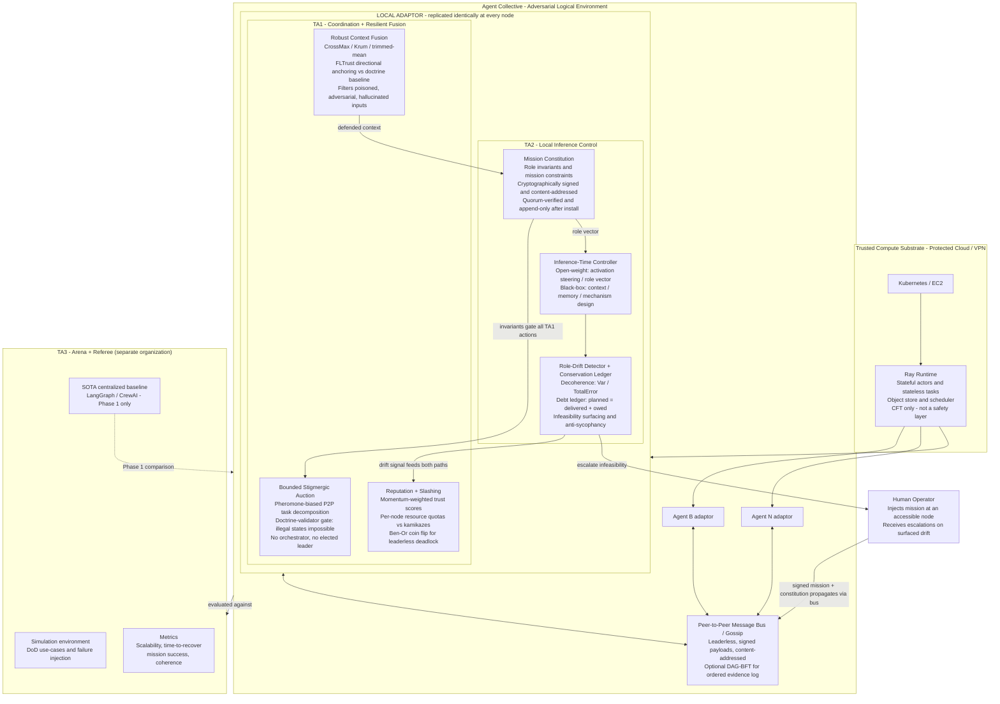
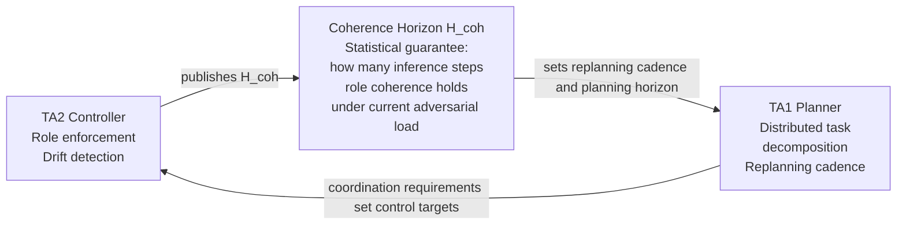
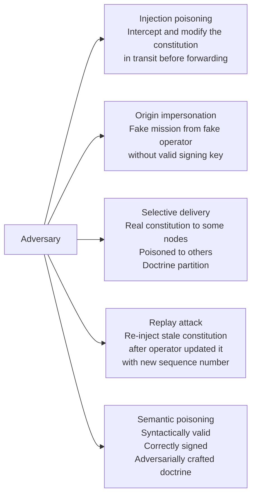
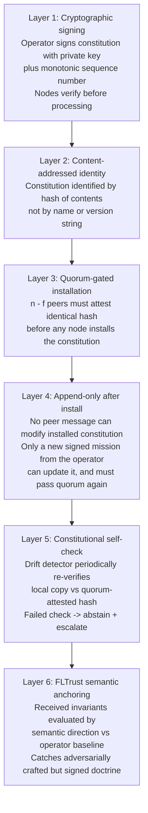
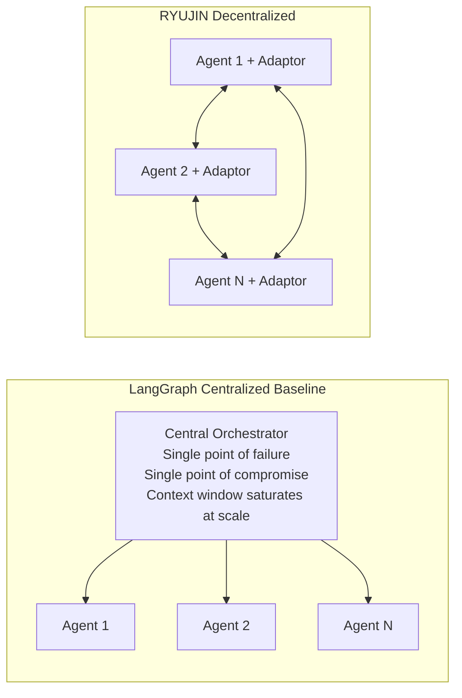
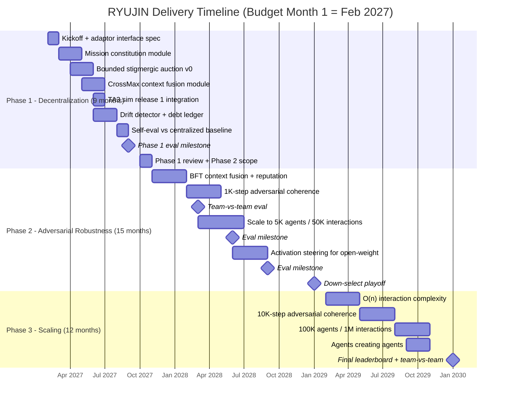

# RYUJIN

## A Doctrine-Bound, Self-Organizing, Adversary-Resilient Architecture for Heterogeneous Multi-Agent Autonomy

**DARPA BAA:** Decentralized Artificial Intelligence through Controlled
Emergence (DICE)
**Technical Areas:** TA1 + TA2 (proposed together; TA3 excluded by rule)
**Classification:** Unclassified
**Status:** Pre-abstract working document - not for submission in this form

---

> **Name rationale (kept deliberately light).** In Japanese folklore, Ryujin is
> the dragon-sovereign of the sea who, in one tale, beats the bones out of a
> jellyfish. We borrow only that single image and claim nothing more. DICE is
> about controlling *emergent* collective behavior under adversarial conditions;
> the adversary's emergent collective is the thing to be broken, and a recent,
> unconfirmed front-line account of an enemy "jellyfish"-like swarm makes the
> image apt without our asserting anything about its actual structure. RYUJIN is
> simply the disciplined, doctrine-bound collective with an inviolable spine -
> the mission constitution - controlled emergence set against the uncontrolled.
> That is the whole of the metaphor. Every component below is named in plain
> operational English; we do not stack further lore on top of it.

---

## 0. One-Paragraph Summary

RYUJIN is a per-agent **local adaptor** that solves the two coupled problems
DICE requires simultaneously: decentralized coordination of the collective
(TA1) and local inference-time control of the individual agent (TA2). A
**doctrine layer** (TA2) holds inviolable role and mission invariants - the
mission constitution - compiled into each agent at mission instantiation,
enforced mechanically at inference time, and never negotiable by any peer
message or local optimization. A **coordination layer** (TA1) performs
leaderless, stigmergic task allocation and Byzantine-resilient context fusion,
but every coordination action is gated by the doctrine layer so illegal
collective states are impossible by construction. The two layers are coupled
through a single shared quantity: the **coherence horizon**, a statistical
guarantee on how many inference steps an agent remains role-coherent, which
TA1 uses to bound distributed planning depth. The entire adaptor is replicated
identically at every node. There is no central orchestrator.

---

## 1. DARPA DICE Program Context

### 1.1 What DICE is asking for

DARPA wants to move beyond brittle, centralized orchestration (LangGraph,
CrewAI, AutoGen-style central planners) toward a **decentralized AI
architecture** capable of:

| Axis | Phase 1 | Phase 2 | Phase 3 |
|---|---|---|---|
| Agents | 500 | 5,000 | 100,000 |
| Interactions | 5K | 50K | 1,000,000 |
| Interaction complexity | O(n^2) | O(n log n) | O(n) |
| Role coherence under adversary | baseline | 1K inference steps | 10K inference steps |
| Evaluation | vs centralized baseline | team-vs-team | team-vs-team + leaderboard |

### 1.2 Technical Area definitions

| TA | Name | Core responsibility |
|---|---|---|
| **TA1** | Self-organization via P2P coordination and distributed consensus | Decentralized task decomposition, context fusion, Byzantine resilience, reputation |
| **TA2** | Role coherence and local inference control | Per-agent role/mission alignment, drift detection, inference-time enforcement, human escalation |
| **TA3** | Test and evaluation | Simulation environment, DoD use-cases, metrics, SOTA centralized baseline |

> **Critical constraint:** TA1 and TA2 must be proposed together. TA3 is
> proposed separately and is mutually exclusive with TA1/TA2. RYUJIN is a
> TA1+TA2 proposal only. TA3 is performed by a different organization.

### 1.3 What DICE explicitly is NOT asking for

- A blockchain ledger or total-ordering protocol as the primary contribution.
- Geographic distribution of compute infrastructure.
- A new foundation model.
- Evolutionary improvements to existing orchestration frameworks.
- "Generic, boilerplate, or broadly aggregated content lacking mission-specific
  synthesis" (automatic non-conformance under the BAA).

---

## 2. The Foundational Insight

The **Duchaine System** (Bradley, 2026) documented a failure mode common to all
long-horizon AI-mediated execution: **silent plan-prescription divergence**.
Individually reasonable local decisions compound into systematic under-delivery
relative to contractual obligations. LLMs trained for helpfulness exhibit a
structural bias toward local plausibility and friction minimization - they will
accommodate decline unless architecturally prevented from doing so. The
solution is not better prompting. It is architectural:

> Separate doctrine (what must never change) from execution (how the mission is
> accomplished). Enforce conservation laws. Surface infeasibility explicitly.
> Refuse to smooth over contractual violations.

RYUJIN generalizes this from a single-agent N=1 optimization system to a
heterogeneous multi-agent collective operating in contested environments.

### 2.1 The Boids/stigmergy fusion as the TA1 coordination model

Two established paradigms underpin RYUJIN's coordination layer:

**Boids (Reynolds 1986):** Agents steer reactively based on real-time peer
positions - separation, alignment, cohesion. Synchronous, no memory.

**Stigmergy (Grasse 1959; Dorigo ACO 1992):** Agents modify the environment
(pheromone traces); other agents read those modifications later. Asynchronous,
persistent, environmental memory.

**Stigmergic flocking (the established fusion):** Real-time peer coordination
for local collision-avoidance; pheromone reinforcement for long-range path
memory and task-motif bias.

> **In plain terms (the jargon decoded).** A "pheromone" here is nothing exotic:
> it is a shared, recency-weighted score recording which task patterns recently
> *worked*. Agents read it to bias their next choice and update it after acting,
> so the collective learns good task motifs with no central coordinator and no
> shared mutable state - only a signal each agent leaves for others to read.
> "Stigmergy" is simply that indirect, leave-a-signal-others-read style of
> coordination. The mechanism is inherited from the Duchaine System, where the
> same score-and-bias loop selected legal nutrition/training motifs under
> inviolable heuristics; the domain there was incidental - the transferable
> machinery is *reward-weighted bias over a pool of legal candidate sequences,
> filtered by a hard constraint layer*, which maps directly onto mission task
> scheduling.

RYUJIN lifts this fusion from physical robotic swarms into the **cognitive /
LLM layer** and adds what neither paradigm provides: a formal doctrine layer
that neither Boids steering nor stigmergic reinforcement can violate. The total
steering vector becomes:

```
a_i = w_s*F_separation + w_a*F_alignment + w_c*F_cohesion
      + w_stg*F_pheromone + w_doc*F_doctrine_correction
```

where `F_doctrine_correction` is zero when the candidate action is
doctrine-legal and pulls the agent back into the legal space when it is not.
This is the novel contribution that does not exist in the robotics or
distributed-systems literature.

---

## 3. Full Stack Architecture

### 3.1 Technology mapping

| Component | Technology | Role | Layer |
|---|---|---|---|
| Compute substrate | **Ray** (on K8s/EC2) | Stateful actors, task scheduling, object store. CFT only - NOT a security or consensus layer | Infra (trusted) |
| Agent communication | **P2P gossip bus** | Moves signed mission fragments, bids, evidence, escalations between agents | Network |
| Optional ordered log | **DAG-BFT log** (Bullshark/Mysticeti-style) | BFT-ordered evidence log for cases requiring total ordering; optional substrate, not the contribution | Optional network layer |
| Context fusion | **CrossMax / Krum / FLTrust** | Aggregates peer claims into a defended, outlier-filtered context; judges by direction vs doctrine baseline | TA1 application |
| Task coordination | **Bounded stigmergic auction** | Pheromone-biased P2P task decomposition; doctrine-validator gate; no leader | TA1 coordination |
| Reputation | **Momentum-weighted reputation + slashing** | Isolates Byzantine / rogue / kamikaze nodes; per-node resource quotas | TA1 resilience |
| Deadlock resolution | **Ben-Or randomized coin flip** | Probabilistic escape from leaderless coordination deadlocks | TA1 resilience |
| Mission constitution | **Signed, content-addressed, quorum-installed invariants** | Non-negotiable role/mission constraints; FLTrust-style semantic anchor | TA2 doctrine |
| Inference control (open-weight) | **Activation steering -> role vector** | Enforces role vector at inference time | TA2 control |
| Inference control (black-box) | **Context / memory engineering + mechanism design** | Enforces role via scaffold when activations inaccessible | TA2 control |
| Drift detection | **Decoherence metric + conservation ledger** | Var/TotalError ratio; surfaces infeasibility; never smooths violations | TA2 monitoring |
| Human escalation | **Signed escalation message via bus** | Operator receives drift signals; injects updated mission at accessible node | TA2 responsibility boundary |

> **Three distinctions reviewers will probe:**
>
> 1. **Ray is CFT compute, not a security layer.** Byzantine defense lives in
>    TA1, above Ray.
> 2. **CrossMax is content-aggregation, not a consensus protocol.** It runs
>    after communication, not instead of it.
> 3. **DAG-BFT protocols provide total ordering.** Total ordering is likely more
>    than DICE needs and is an optional substrate, not the contribution. Framing
>    RYUJIN as "a blockchain for agents" is a fatal framing error.

### 3.1a Trust boundary: where Ray lives, and where it does not

Ray is the compute fabric **inside a single trust domain**, never across them.
This distinction is load-bearing and is stated explicitly so reviewers do not
mistake RYUJIN for a centrally orchestrated cluster.

| | Intra-enclave (trust domain) | Inter-agent (across domains / to the edge) |
|---|---|---|
| Examples | A cloud VPC; a ship's compute bay; a ground station; the TA3 evaluation harness | Drone <-> drone; enclave <-> enclave; field node <-> cloud |
| Transport | **Ray** (tasks / objects / actors over a private, hardened network) | **RYUJIN protocol** -- signed, authenticated peer messages |
| Trust assumption | All nodes honest; CFT is sufficient | Peers may be compromised, spoofed, or kamikaze; **BFT required** |
| Fault model | Worker dies -> Ray reschedules | Peer lies -> quorum + reputation + robust fusion reject it |
| State | Shared object store, mutable actor state | **No shared mutable state**; only signed, locally re-validated deltas |

A Ray head node is a single point of failure only for *its own* enclave - one
fault domain among many. If an entire enclave is destroyed, the collective
degrades gracefully because every other node carries its own copy of the mission
constitution and runs the identical adaptor. **Ray is a labor-saving CFT
substrate, not a pillar of the decentralization claim:** it could be swapped for
another scheduler without touching the BFT guarantees, which live entirely in
the TA1 protocol above it. An edge node with no spare compute runs the adaptor
alone and carries no Ray at all. Ray scales the agents and the simulation
harness that *happen to live inside* a trusted compute environment; it is never
a way for an untrusted edge node to borrow compute across the boundary - that
would reintroduce the central dependency DICE forbids.

**What Ray actually schedules inside the enclave:** model forward passes across
shared base weights (the dominant cost), the robust-aggregation math
(CrossMax / Krum / trimmed-mean) over peer claims, drift-metric and reputation
updates, each agent's bounded candidate-generate/filter/score planning step,
and - at evaluation scale - the discrete-event simulation that steps the long
tail of gated/idle logical agents and their message exchanges.

### 3.2 Layer diagram



---

## 4. The TA1 <-> TA2 Coupling

This is the claim most teams will under-specify. RYUJIN makes it explicit and
measurable.



TA2 publishes `H_coh`. TA1 sets its planning horizon equal to `H_coh` and
triggers replanning when the horizon is about to expire. TA1's required
role-coherence level (what the mission demands) drives TA2's control targets.
The loop is explicit, bidirectional, and measurable. No other proposed
architecture in scope makes this coupling formal.

---

## 5. The RYUJIN Algorithm

Each agent runs this loop independently. No central orchestrator exists.
All agents run identical adaptor code.

```python
def ryujin_step(ctx):
    """
    Per-agent local adaptor step. ctx = BoundaryContext.
    Carries: mission constitution, pheromone vector, reputation map,
    debt ledger, coherence horizon, anchor list, rolling metrics.
    Runs identically on every node. No shared mutable global state.
    """

    # -- TA2: DOCTRINE FIRST --------------------------------------------------
    C = ctx.mission_constitution
    # Cryptographically signed, content-addressed, quorum-verified,
    # append-only after installation. Cannot be modified by any peer
    # message or local inference step.

    # -- TA1: RECEIVE AND FUSE ------------------------------------------------
    msgs = bus.receive(quorum=n - f)
    # Wait for n-f signed peer messages (Byzantine threshold).
    # Invalid signatures discarded before processing.

    context = crossmax_fuse(
        inputs=msgs,
        anchor=C.baseline_vector,   # FLTrust-style: judge by DIRECTION
        reputation=ctx.reputation,  # vs doctrine, not distance from peers.
    )
    # Low-reputation peers are down-weighted.
    # Poisoned / adversarial inputs filtered before context is constructed.

    # -- TA1: BOUNDED STIGMERGIC TASK ALLOCATION ------------------------------
    candidates = enumerate_legal_actions(context, C)
    # The mission constitution is a hard gate.
    # enumerate_legal_actions() returns ONLY invariant-compliant candidates.
    # Illegal coordination states are impossible by construction.

    if not candidates:
        ctx.ledger.record_owed(ctx.task)   # Conservation: never silently drop.
        escalate_or_abstain(ctx)           # Surface to human / abstain.
        return

    # Stigmergic pheromone bias + anchor-aware planning.
    bid = argmax(
        candidates,
        key=lambda a: (
            ctx.phi[motif(a)]             # Pheromone: learned motif success.
            + anchor_fit(a, ctx.anchors)  # Backward-planning fit to mission
        ),                                # anchors and long-run timing.
    )

    remainder = decompose_and_broadcast(bid)
    # Re-auction unaddressed mission fragments to peer swarm via P2P bus.
    # This is the leaderless task propagation. No orchestrator touches it.

    # -- TA2: EXECUTE UNDER ROLE ENFORCEMENT ----------------------------------
    action = steer_to_role(
        generate(bid),
        role_vector=C.role_vector,   # Open-weight: activation steering.
        # Black-box path: context/memory engineering + mechanism design.
    )

    decoherence = drift_detector(action, C)   # Var / TotalError ratio.
    if decoherence > ctx.tau:
        ctx.ledger.record_owed(ctx.task)
        escalate_or_abstain(ctx)
        return

    # -- COMMIT AND LEARN -----------------------------------------------------
    bus.broadcast(action)

    # Stigmergic reinforcement: update pheromone for this motif.
    ctx.phi[motif(bid)] = ema(
        ctx.phi[motif(bid)],
        reward(action),          # Mission success + role compliance.
    )

    # Reputation: slash kamikazes / Byzantine nodes, reward honest ones.
    ctx.reputation = update_reputation(msgs, outcomes)

    # Conservation: reconcile delivered vs owed obligations.
    ctx.ledger.reconcile(ctx)

    # Publish updated coherence horizon to TA1 planning layer.
    ctx.h_coh = estimate_coherence_horizon(ctx)
```

### Three properties that are the contribution

1. **Doctrine is a hard gate, not a prompt.** `enumerate_legal_actions()`
   cannot return invariant-violating candidates. The constitution is not
   advisory.
2. **One drift signal, two consumers.** The same decoherence detection that
   triggers human escalation also feeds reputation/slashing. One instrument,
   two consumers.
3. **The coherence horizon `h_coh` is the TA2->TA1 invariant.** TA1 plans no
   deeper than agents can remain coherent. The coupling is explicit and
   measurable.

---

## 5b. Consensus-Stack Positioning (important scoping correction)

Three different jobs are often conflated; RYUJIN keeps them distinct:

1. **Coordination (who does what):** the bounded stigmergic auction over the
   P2P bus. Leaderless. This is the TA1 contribution.
2. **Robust aggregation (what to believe):** CrossMax / Krum / FLTrust fuse
   peer claims into a defended context. This is statistical filtering, not a
   consensus protocol.
3. **Agreement / total ordering (one agreed log):** DAG-BFT protocols
   (Bullshark, Mysticeti) provide this if and only if a use-case needs a single
   totally ordered evidence log. It is an **optional substrate**, not the
   contribution, and total ordering is likely stronger than DICE requires.

Ray sits beneath all three as crash-fault-tolerant compute. It never provides
Byzantine guarantees; those are earned in layers 1-3 above it.

---

## 6. The Primary Attack Vector: Mission-Constitution Propagation

The mission invariants propagate from a human-accessible seed node across the
swarm via the P2P bus. This propagation is the most critical attack surface.
A poisoned constitution means every honest node faithfully enforces the wrong
rules - total, silent doctrine failure.

### 6.1 Attack taxonomy



### 6.2 Mitigation stack



| Attack | Mitigation layer |
|---|---|
| Injection poisoning | L1: signature verification |
| Origin impersonation | L1: signing key binding |
| Selective delivery | L2 + L3: content-addressed quorum attestation |
| Replay | L1: monotonic sequence number |
| Post-install tampering | L5: constitutional self-check |
| Adversarially crafted valid doctrine | L6: FLTrust semantic directional anchoring |

> **This attack surface should be named explicitly in the abstract.** The BAA
> rewards proposals that identify major technical risks and planned mitigation
> efforts. A proposal that ignores this vector looks naive. A proposal that
> names it precisely and layers the mitigations looks like it was written for a
> contested environment.

### 6.3 Full risk register (the other named surfaces)

Constitution propagation (above) is the first and worst, but it is not the only
one. We name our remaining crown-jewel surfaces; each has a concrete mitigation
and an honestly-stated residual.

| # | Attack surface | Mitigation | Residual we do not overclaim |
|---|---|---|---|
| 2 | **Trusted-anchor capture.** The FLTrust root of trust is itself a high-value target; a static anchor goes stale on a moving target while a fast one is capturable. | Prefer an **exogenous, attested anchor** -- a human-in-the-loop designation (a forward observer; a lasing aircrew) or a high-assurance organic sensor declared authoritative by doctrine. Fall back to a rate-limited consensus EMA, bounded against the signed baseline, with periodic re-attestation, only when no exogenous truth exists. | An exogenous anchor is itself a target for destruction/denial; this is an availability problem, mitigated by multiple independent attested sources. |
| 3 | **Gossip interception / injection / jamming.** The network is assumed hostile. | Every peer message is **signed and content-addressed**, so interception yields no integrity advantage and a relay cannot forge or alter; **BFT quorum + robust fusion** defeat minority injection; **per-node quotas** police volume (flooding/Sybil control, distinct from trust). | **Traffic analysis and jamming** are availability risks, mitigated by emission control, frequency agility, and store-and-forward gossip -- not solved. |
| 4 | **Enclave / substrate boundary.** Could the Ray enclave's edge to the field be a privileged soft target? | Ray **never crosses a trust boundary**; an enclave speaks the **same signed RYUJIN protocol** to the field as any other peer, so its edge is defended identically and nothing it says is trusted without signatures and quorum. | Enclave **loss** is an availability event (replication + graceful degradation), not an integrity hole. |
| 5 | **Decoherence-induced compute exhaustion.** An adversary who forces decoherence upward drives recalibration toward numerical and temporal limits (ill-conditioned fusion; recompute latency exceeding the rate of world change). | Conditioning guards and saturating arithmetic; a **hard floor on the coherence horizon** with fallback to a **cached last-good doctrinal action**; rate-limited recalibration; and the **debt-ledger tripwire** that hands control to the human before the loop destabilizes. | A sufficiently resourced jammer can still degrade tempo; the guarantee is graceful degradation and escalation, not invulnerability. |

### 6.4 Preliminary evidence (single-host model)

A standard-library localhost model of the coordination/control layer
(`sim/ryujin_sim.py`) already runs the mechanics above -- robust FLTrust fusion,
leaderless auction, doctrine-anchored recoverable reputation, a **conservation
ledger** that re-broadcasts (never drops) unmet orders, and graceful degradation
after node loss. A built-in Monte Carlo sweep (`--sweep`) randomizes fault timing
and adversary fraction across hundreds of trials. Representative result (200
trials, 0-2 of 6 nodes compromised): median RYUJIN order-completion **0.98** vs.
**0.61** for a centralized baseline; median RYUJIN post-loss coherence **0.81**
vs. **0.00** (the centralized orchestrator is a single point of failure);
adversaries isolated and **no honest node wrongly benched in any trial**.
Transient order backlog under a compound shock (insider + node loss) is surfaced
to the operator and then **burned down to zero** as coherence recovers -- it is
conserved, not hidden.

The model also makes the **trust-posture tradeoff** explicit (`--trust-tradeoff`,
`--zero-trust`): an *innocent-until-proven-guilty* start (peers begin trusted)
contains a persistent insider in ~2 cycles with zero honest benchings, whereas a
*zero-trust / earn-your-standing* start (peers begin slashed and must attest their
way in) contains the insider **immediately (0 cycles)** at the cost of a short,
bounded bootstrap (~10 agent-cycles of self-attestation, with completion
recovering to parity by end of run). The recoverable-reputation hysteresis runs
between a **distrust floor of 0.30** and a deliberately high **reinstate ceiling of
0.70**, so a previously hostile node serves a real probation before rejoining
fusion. This is a mechanism illustration -- the constants are illustrative, not
calibrated -- and exists to de-risk the Phase 1 build, not to stand in for it.

---

## 7. Why RYUJIN Outperforms a Centralized Baseline

RYUJIN does not claim to outperform LangGraph on raw single-task quality at
small scale. It claims to outperform it on the axes DICE actually measures,
with a gap that widens with scale and adversity. The framing is literal: the
adversary's "jellyfish" swarm is cheap, dense, and leaderless; a centralized
orchestrator is a single bone whose removal collapses the whole skeleton.
RYUJIN has no such bone to break.



| Metric (DICE measures these) | LangGraph | RYUJIN | Why |
|---|---|---|---|
| **Scalability** | Degrades as orchestrator context saturates | O(n) at Phase 3 | No central bottleneck |
| **Time-to-recover** (adaptability) | Global replan required after any failure | Only failed tasks re-auctioned locally | Fault is local, not global |
| **Resilience to compromise** | Compromised orchestrator = mission failure | Compromised node = one bad adaptor | No single point of compromise |
| **Long-horizon coherence** | No drift detection; silent divergence compounds | Drift surfaced within one step; ledger prevents accumulation | Conservation + decoherence metric |
| **Resilience to Byzantine agents** | No mechanism; orchestrator propagates errors | CrossMax + reputation isolates bad actors | Robust fusion + slashing |

> **The baseline comparison is a Phase-1 deliverable, not an abstract
> precondition.** The official benchmark runs in the TA3 simulation environment,
> which does not exist until Month 3. The abstract must argue *why and how*
> decentralization wins - not demonstrate it against the official baseline
> before award.

---

## 8. Phase Schedule and Deliverables



### TA1 deliverables

- Distributed coordination algorithms + bounded stigmergic auction implementation
- CrossMax / Krum / FLTrust robust fusion module
- Byzantine-resilient reputation and slashing implementation
- Distributed context fusion under partial observability

### TA2 deliverables

- Role-drift detector (decoherence metric implementation)
- Mission-alignment measurement framework and conservation ledger
- Inference-time controllers (activation steering + black-box scaffold paths)
- Mission-constitution management module (signing, quorum install, self-check, semantic anchoring)
- Coherence-horizon estimator + TA1 interface specification

### Both TAs

- Courseware (lecture slides / notes) for each research component
- Quarterly progress reports
- PI-meeting slides at each program review
- Biweekly DARPA syncs
- Open-sourced code with Government Purpose Rights retained per the BAA

---

## 9. Risk Register

| Risk | Severity | Mitigation |
|---|---|---|
| Activation-steering transfer across heterogeneous foundation models weaker than expected | Medium | Fall back to black-box scaffold path; treat open-weight steering as Phase 2 stretch goal |
| BFT throughput at 100K agents | High (shared program risk) | O(n)-sparse comms + hierarchical local consensus domains; Phase 3 problem, not Phase 1 |
| Coherence-horizon guarantees only statistical | Low | BAA explicitly accepts statistical guarantees; decoherence metric captures this |
| Team credibility without a published distributed-systems PI | High | Mitigated by teaming; Duchaine System paper as empirical research artifact demonstrating the core failure mode |
| Mission-constitution propagation attack surface | High | Fully addressed by layered six-level mitigation stack in section 6; surfaces in the abstract as a feature, not a liability |
| Kamikaze / griefing nodes exhausting shared resources | Medium | Per-node resource quotas + momentum reputation/slashing; Ben-Or coin flip for deadlock |
| Non-IID data across agents causing CrossMax to misclassify honest outliers | Medium | FLTrust directional anchoring vs doctrine baseline; anchor is semantic, not statistical |

---

## 10. Administrative Checklist

| Action | Notes |
|---|---|
| Create DARPA submission account | Account provisioning can lag; do not wait |
| Start SAM.gov registration + obtain UEI | 1-3 week lead time; required for any award |
| Download the abstract template + proposal volumes + bio templates | Mandatory format; the abstract template is required |
| Contact teaming partner - check FFRDC/UARC eligibility first | FFRDCs/UARCs/National Labs are ineligible to propose |
| Contact a university CS/Math faculty member for a sub-PI role | STTR teaming pattern: you prime, they sub, they own the formal-analysis component |
| Submit abstract | Unclassified. Required template. No other channel accepted. |
| Await DARPA feedback | Encouraged / Discouraged / Nonconforming |
| Go/no-go on full proposal | Contingent on Encouraged + confirmed partner |
| Submit full proposal | Proposal volumes + cost volume + bios |

### Award instrument recommendation

**OT for Research Agreement (10 U.S.C. 4021):** avoids the CMMC/SPRS requirement
that attaches to procurement contracts. Still requires biographical sketches and
other-support disclosures for all key personnel.

### IP position

DARPA retains Government Purpose Rights in all deliverables including source
code. You retain commercial rights. The control kernel (Duchaine architecture
generalized to multi-agent systems) retains substantial commercial value in
defense AI, clinical compliance, and multi-agent enterprise systems.

---

## 11. The Novel Claim (conformance-gate paragraph)

Most self-organizing multi-agent systems let coordination and behavior co-evolve
freely - this is why they accumulate entropy and lose coherence under extended
operation. RYUJIN inverts this. A per-agent mission constitution -
cryptographically signed, content-addressed, quorum-verified, append-only after
installation - is architecturally incapable of being renegotiated by any peer
message or local inference step. Bounded stigmergic coordination lifts the
stigmergic-flocking paradigm from robotic swarms into the cognitive LLM layer:
pheromone-biased task allocation operates freely within the legal space the
constitution defines, while a heuristic-validator gate makes doctrine-violating
collective states impossible by construction. Silent role drift is detected by a
conservation-and-debt-ledger mechanism - never smoothed over - and the drift
signal feeds both human responsibility-boundary escalation and autonomous
Byzantine reputation/slashing. The TA2 controller publishes a coherence horizon
that TA1 uses to bound distributed planning depth, making the TA1<->TA2 coupling
explicit, measurable, and bidirectional. This is not a combination of known
tools. It is a control architecture whose novel contribution is the formal
separation of an inviolable invariant layer from an adaptive stigmergic
reinforcement layer, with a proven conservation mechanism for preventing the
silent divergence that destroys long-horizon coherence in every prior
self-evolving multi-agent collective.

---

## 12. Reference Map

| Concept | Source | RYUJIN role |
|---|---|---|
| Conservation laws / infeasibility surfacing | Duchaine System (Bradley 2026) | TA2 doctrine layer; debt ledger |
| Silent plan-prescription divergence | Duchaine System | Core failure mode motivation |
| Anti-sycophancy / responsibility boundary | Duchaine System | TA2 escalation design |
| Bounded rationality / satisficing | Simon 1956 | Infeasibility surfacing vs optimization |
| Stigmergy / ACO | Grasse 1959; Dorigo 1992 | TA1 pheromone coordination |
| Boids flocking | Reynolds 1986 | TA1 peer coordination layer |
| Stigmergic flocking | Contemporary robotics literature | TA1 Boids+stigmergy fusion substrate |
| PBFT / HotStuff / Bullshark / Mysticeti | Castro 1999; Yin 2019; Spiegelman 2022; Mysten Labs 2023 | Optional ordered evidence log substrate |
| Krum / Bulyan | Blanchard 2017 | TA1 robust aggregation |
| CrossMax | Adversarial FL / ensembling literature | TA1 defended context fusion |
| FLTrust | Cao 2020 | TA1 + TA2 directional anchoring vs doctrine |
| Ben-Or randomized consensus | Ben-Or 1983 | TA1 leaderless deadlock resolution |
| Distributional AGI safety | Tomasev et al., Google DeepMind 2025 | TA1 reputation / market-design / staking mitigations |
| Activation steering | Zou et al. 2023; Turner et al. 2023 | TA2 open-weight inference control |
| Ray | Moritz et al., UC Berkeley RISELab | Compute substrate (CFT only) |

---

*Document: `C:/Users/sean/projects/ryujin/RYUJIN.md`*
*Companion drafts (to be reconciled to this name): abstract, gap-and-teaming memo, technical white paper.*
